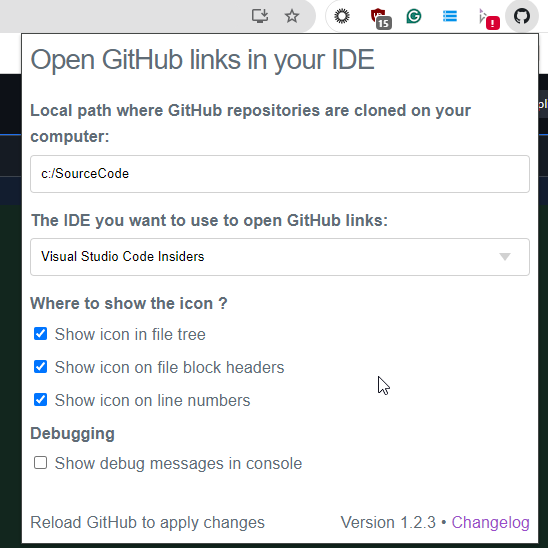
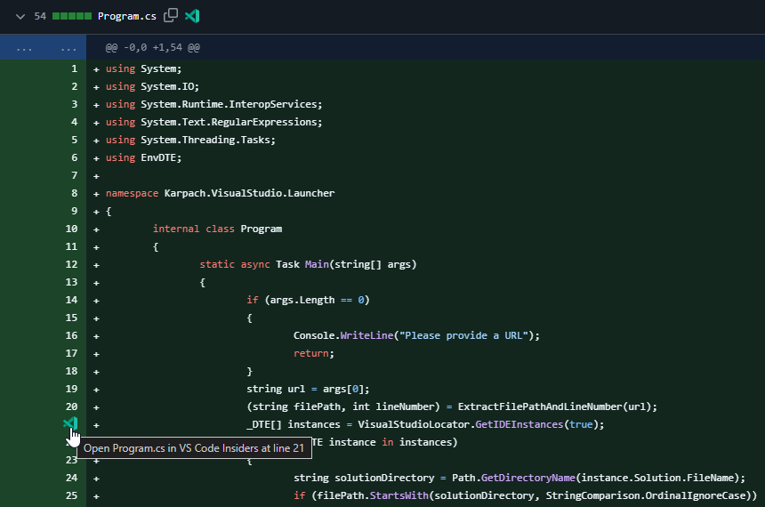
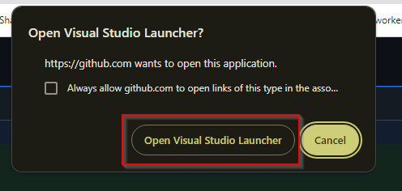

# Visual Studio Launcher tool


vs-launcher repositroy compiles into vs-launcher.exe.

That executable expect a custom protocol url passed as an argument. The custom protocol url should be in the following format:

```
vscode-insiders://file/c:/SourceCode/vs-launcher/Program.cs:10
```

The executable will traverse all open Visual Studio instances, find the instance with corresponding solution open,
and open the file at the specified line.

The tool works in conjution with Google Chrome extension:

[Open GitHub in IDE](https://chromewebstore.google.com/detail/open-github-in-ide/bmifnnfmccmleigpaolofacllndmfned?hl=en)

[Open GitHub in IDE GitHub Repo](https://github.com/lmichelin/open-github-links-in-ide)

## Installation Instructions:
1. Install the Chrome extension from the above link
2. In extension options set Local path where GitHub repositories are cloned
3. Set "The IDE you want to use to open GitHub links" to "Visual Studio Code Insiders"



4. Compile the solution in this repository or download the latest release from the releases page
5. Edit registration.reg file and replace the path to vs-launcher.exe with the path to your vs-launcher.exe
6. Run registration.reg
7. Try clicking an icon in the GitHub file view





